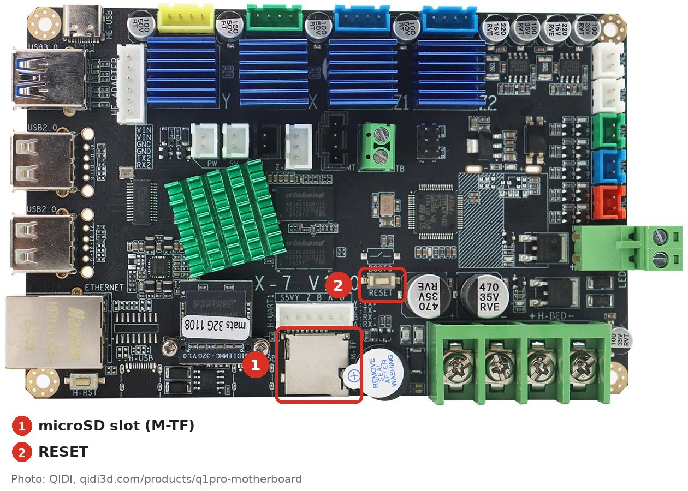
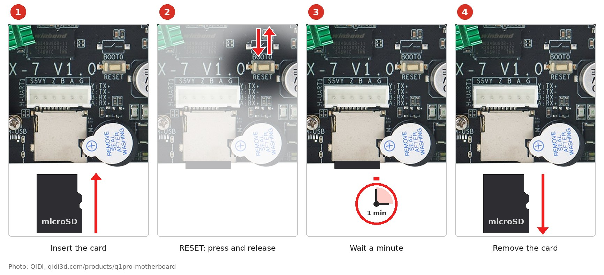
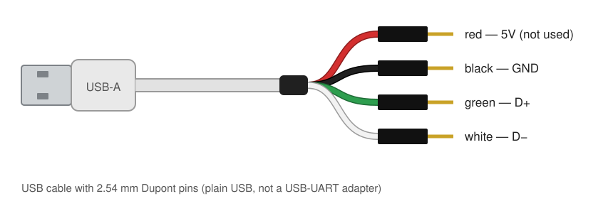
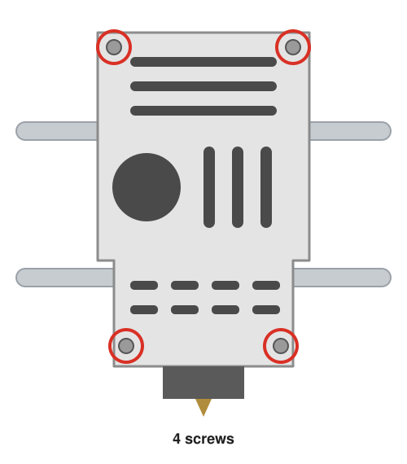
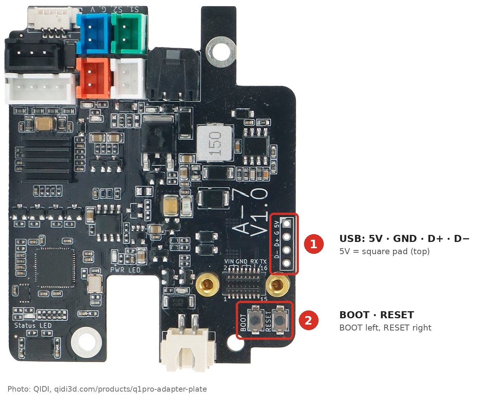
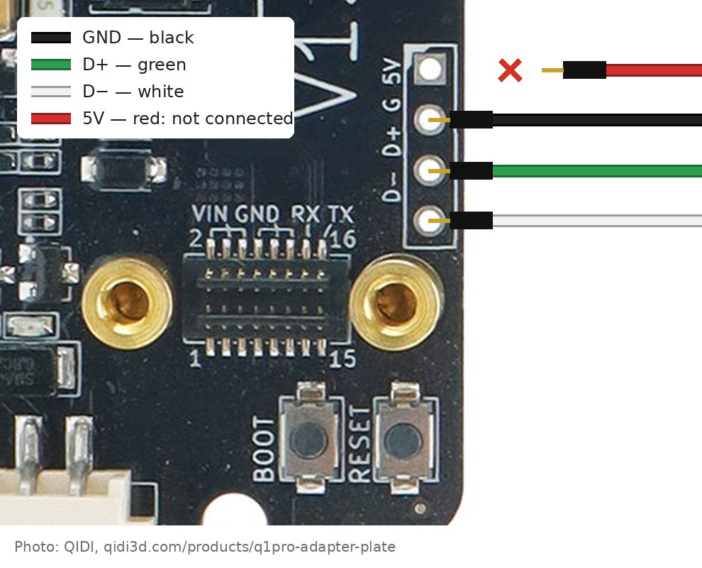
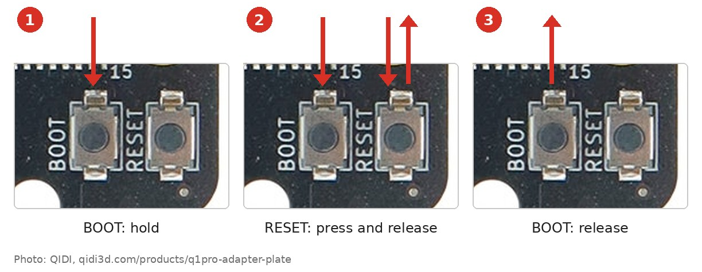

# QIDI Q1 Pro: стоковые прошивки MCU

[English](README.md)

Оригинальные прошивки QIDI для обеих плат QIDI Q1 Pro: основной (STM32F401) и
головы (RP2040). Нужны, чтобы вернуться на стоковую прошивку после mainline
Klipper или восстановить плату.

> Работают только со стоковым Klipper от QIDI. Mainline Klipper к ним не
> подключится.

| Файл | Плата | Как |
|---|---|---|
| `qd_mcu.bin` | основная | microSD |
| `stock-toolhead.uf2` | голова | USB-кабель, кнопка BOOT |
| `qidi-bootloader-0x08000000.bin` | основная | обычно не нужен, см. [ниже](#бутлоадер-qidi-qidi-bootloader-0x08000000bin) |

## Основная плата: `qd_mcu.bin`

Нужна microSD-карта в FAT32. Скопировать на неё `qd_mcu.bin` в корень. Файл не
переименовывать.

На основной плате есть слот microSD (отмечен цифрой 1) и над ним кнопка RESET
микроконтроллера (отмечена цифрой 2).

На включённом принтере:

1. Вставить карту в слот.
2. Нажать и отпустить RESET. Микроконтроллер перезапустится и прошьёт файл с карты.
3. Подождать минуту.
4. Вынуть карту. Выключать принтер не нужно.

## Голова: `stock-toolhead.uf2`

Понадобится:

* USB-кабель с разъёмами Dupont 2,54 мм на другом конце. Обычный USB, не
  USB-UART адаптер. Кабель только для зарядки (только красный и чёрный провода)
  не подойдёт;
* стяжка;
* компьютер.

### 1. Снять заднюю крышку головы

Выключить принтер. Открутить 4 винта задней крышки головы и снять её.

### 2. Подключить кабель

На правом краю платы головы есть 4 отверстия для USB (отмечены цифрой 1), под
ними кнопки BOOT и RESET (отмечены цифрой 2).

Вставить пины в отверстия, сверху вниз:

* **5V** (квадратная площадка, сверху): ничего. Красный провод не подключать.
* **GND**: чёрный.
* **D+**: зелёный.
* **D−**: белый.

Отверстия пины не держат. Стянуть провода стяжкой так, чтобы каждый был слегка
натянут и его пин прижимался к отверстию.

### 3. Перевести голову в режим USB

1. Вставить USB в компьютер.
2. Включить принтер.
3. Зажать BOOT, нажать и отпустить RESET, отпустить BOOT.

На компьютере появится новый диск `RPI-RP2`.

### 4. Прошить

Скопировать `stock-toolhead.uf2` на диск `RPI-RP2`. Когда копирование
закончится, диск сам пропадёт, а голова запустит новую прошивку.

Выключить принтер, отключить кабель, поставить крышку на место.

### Если `RPI-RP2` не появляется

* Поменять местами зелёный и белый провода: у некоторых кабелей цвета не
  совпадают со стандартом.
* Проверить, что каждый пин прижат к своему отверстию. Затянуть стяжку сильнее.
* Повторить BOOT и RESET. Ещё можно держать BOOT при включении принтера.
* Попробовать другой кабель: в нём должно быть 4 провода.

---

## Подробности

### Бутлоадер QIDI: `qidi-bootloader-0x08000000.bin`

Обычно не нужен. Это загрузчик основной платы, который шьёт `qd_mcu.bin` с
microSD. Ни прошивка с карты, ни Klipper, ни Katapult его не трогают. Пригодится,
только если он повреждён и плата перестала прошиваться с карты.

С microSD его не залить, только с адреса `0x08000000` через ROM-загрузчик STM32
или SWD.

Он байт в байт совпадает с бутлоадером с другого Q1 Pro, то есть он одинаковый
у всех Q1 Pro.

### Что затирается

* `qd_mcu.bin` пишется с `0x08008000`. Если на плате стоял Katapult, он
  затрётся. Бутлоадер QIDI остаётся.
* `stock-toolhead.uf2` пишется с начала флеша RP2040. Своего бутлоадера у QIDI
  на голове нет. Режим `RPI-RP2` зашит в ROM RP2040 и не стирается, поэтому так
  прошить голову можно всегда.

### Откуда файлы

Дамп флеша обеих плат стокового Q1 Pro, снят 2026-10-08 командой Klipper
`debug_read`. Два прохода совпали байт в байт. Версия прошивок:
`v0.10.0-530-g3387a9c2-dirty`, сборка QIDI от 2022-12-22.

| Файл | Источник |
|---|---|
| `qd_mcu.bin` | флеш основной платы, `0x8000`–`0xDC4C` |
| `qidi-bootloader-0x08000000.bin` | флеш основной платы, `0x0`–`0x8000` |
| `stock-toolhead.uf2` | флеш головы, `0x0`–`0x5D00` (boot2 W25Q080 + Klipper) |

Проверить файлы: `sha256sum -c SHA256SUMS`. Ни один из них пока не записывался
на железо.

### Лицензии

* `qd_mcu.bin` и `stock-toolhead.uf2` — сборка Klipper от QIDI, лицензия GNU
  GPLv3. Исходники QIDI: https://github.com/QIDITECH/klipper (сборка помечена
  `-dirty`, то есть собрана из дерева с незакоммиченными правками).
* `qidi-bootloader-0x08000000.bin` принадлежит QIDI. Выложен здесь только для
  восстановления принтеров.
* Фото плат — фото товаров QIDI: плата головы
  (https://qidi3d.com/products/q1pro-adapter-plate) и основная плата
  (https://qidi3d.com/products/q1pro-motherboard), с нашими пометками.
